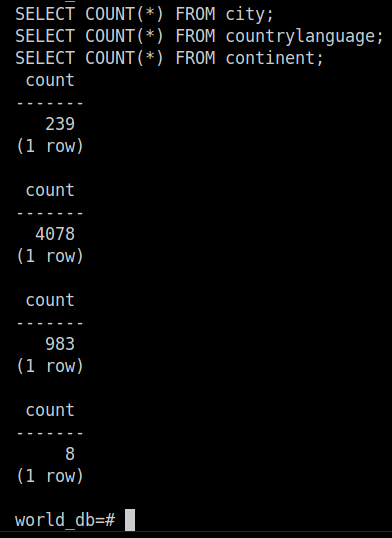

# Taller PostgreSQL — Base de datos World (country, city, countrylanguage, continent)

**Estudiante:** Camilo García

## Estructura

```text
taller-world-db/
├── README.md
├── sql/
│   ├── 01_schema.sql              # Crea las 4 tablas (con relaciones y llaves foráneas)
│   ├── 02_load_data.sql           # Carga los datos en el orden correcto
│   └── 03_migracion_continent.sql # Caso de uso: poblar la tabla continent
├── data/
│   ├── country.sql                # INSERT de países (ya limpio de caracteres inválidos)
│   ├── city.sql                   # INSERT de ciudades (ya limpio)
│   └── countrylanguage.sql        # INSERT de idiomas (ya limpio)
└── img/                            # Aquí van tus capturas de evidencia
```

## Nota sobre los caracteres inválidos

Los archivos `data/*.sql` originales tenían el carácter `�` (dato corrupto/perdido, típico de una mala conversión de codificación) en nombres con tildes o eñes (ej. "Jos� Eduardo" en vez de "José Eduardo"). Ese carácter **no se puede recuperar** con certeza (el byte original ya no existe), así que se eliminó para que el texto quede limpio y el `INSERT` no falle ni se vea con símbolos raros. Esto no afecta la sintaxis SQL — los datos son válidos para cargar.

## Cómo ejecutar en la terminal de VS Code

### 1. Conéctate a tu base de datos

```bash
psql -h localhost -p 5433 -U bkseducate -d bkddb
```

(ajusta host/puerto/usuario/base según tu conexión actual)

### 2. Crea una base de datos limpia para este taller (opcional pero recomendado)

Dentro de psql:

```sql
CREATE DATABASE world_db;
\c world_db
```

### 3. Sal de psql y ejecuta los scripts desde la terminal del sistema

Parado en la carpeta `taller-world-db/`:

```bash
psql -h localhost -p 5433 -U bkseducate -d world_db -f sql/01_schema.sql
```

Esto crea las 4 tablas con sus relaciones y llaves foráneas.

### 4. Cargar los datos

**Importante:** los `INSERT` deben ejecutarse en orden: primero `country`, luego `city` y `countrylanguage` (porque tienen llave foránea hacia `country`).

```bash
psql -h localhost -p 5433 -U bkseducate -d world_db -f data/country.sql
psql -h localhost -p 5433 -U bkseducate -d world_db -f data/city.sql
psql -h localhost -p 5433 -U bkseducate -d world_db -f data/countrylanguage.sql
```

(El archivo `sql/02_load_data.sql` hace lo mismo automáticamente con `\i`, pero solo funciona si lo ejecutas **desde dentro de psql**, no desde la terminal del sistema, y estando parado en esta misma carpeta.)

### 5. Migrar los continentes

```bash
psql -h localhost -p 5433 -U bkseducate -d world_db -f sql/03_migracion_continent.sql
```

Esto lista los continentes distintos, los inserta en la tabla `continent`, y verifica el resultado.

### 6. Verificar que todo cargó bien

Dentro de psql:

```sql
SELECT COUNT(*) FROM country;         -- debería dar 239
SELECT COUNT(*) FROM city;            -- debería dar 4078
SELECT COUNT(*) FROM countrylanguage; -- debería dar 983
SELECT COUNT(*) FROM continent;       -- debería dar 8
```

Si esos números coinciden, la migración fue exitosa.

---

## 7. Evidencia — Verificación final

Los siguientes conteos confirman que la migración fue exitosa:

| Tabla            | Registros esperados | Resultado |
|------------------|---------------------|-----------|
| `country`        | 239                 | ✅ 239    |
| `city`           | 4078                | ✅ 4078   |
| `countrylanguage`| 983                 | ✅ 983    |
| `continent`      | 8                   | ✅ 8      |


